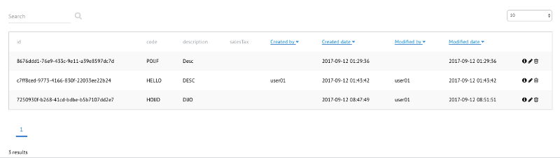

#### Model generator project

The model generator project is a framework for generating text file from UML class diagrams.

This project use the ECore Eclipse plugin to design the UML model and Apache FreeMarker template engine.

You can find more documentation about 

- ECore tool at [http://www.eclipse.org/ecoretools/overview.html](http://www.eclipse.org/ecoretools/overview.html)
- FreeMarker at [http://freemarker.org/](http://freemarker.org/)

## Supported field types
- byte
- short
- int
- long
- float
- double
- string
- boolean
- Date
- Enums


### Attribute and Class naming convention

__WARNING__ : The attributes and classes should follow the camelcase naming standard.

Avoid also to use reserved Java, Protobuf, HTML or Typescript or any programming language words.


### Annotations

The generator use ECore annotation to share model parameters to the generators. 

##### 1. Generator Specific Annotations
Below is the list of the supported annotations :

- __PK__   : Primary key __attribute__. Only int, long and String types are supported.
- __AUTO__ : For a primary key __attribute__, indicates that the key needs to be generated. For int and long, it will be a serial. For String a UUID.
- __QUERY__ : Indicates that the __attribute__ can be query in the search. Add __EQUAL__ to query of type string to search the exact value instead of wildcard
- __LONG__ : For a long String __attribute__ to specify the length of the String, use LENGHT detail to specify the length. (default: 10000) 
- __ListHide__ : Indicates that the __attribute__ will not be visible in the list view.
- __SORT__ : Indicates that the __attribute__ can be used to sort the entity
- __PUBLISH__ : Publish the entity to Kafka
- __SUBSCRIBE__ : Subscribe to this __entity__ from Kafka topic
- __LOCATION__ : Used for a String __attribute__, the field will be considered as a JTS geometry. Use only when you plan to use Postgresql/Postgis database.
- __AUDIT_AWARE__ : to mark an __entity__ as audit-able. This will have additional SpringData annotations and schema with created_date, modified_date, created_by and modified_by columns.
- __EXTENDABLE__: Mark an __entity__ as extendable will add an extension fields to it and the extension schema. Extension field and schema will be stored as a JSON data.
- __VERSIONABLE__: Mark an __entity__ as versionable will add the optimistic lock _@Version_ field in the entity. 

###### 1.1 Kafka Publish
With the __PUBLISH__ annotation on your entity class, you will make your entity published to Kafka.
For example, if you have a Car entity that you want to publish, you can
set the following properties:

  - _kafka.___car___TopicName_: Topic name. default: carTopicName
  - _kafka.___car___Partition_: Partition name. default: carPartition
  - _kafka.___car___ConsumerGroup_: Consumer group. default: carConsumerGroup

You need to enable the Kafka publish with a property for each entity.

```txt
car.kafka.publish=true
```

###### 1.2 Kafka Subscribe
With the __SUBSCRIBE__ annotation on your entity class, you will be able to subscribe to Kafka messages.

To enable the subscription, you need to set a property :

```txt
car.kafka.subscribe=true
```

Subscring to the new events is really easy. You just have to subscribe to the Observable created for you.
For example, if you want to subscribe to your Car entity Kafka event, you can use the following code:

```java
@Component
@Slf4j
public class CarReaderSample {

  @Autowired
  private Observable<Car> carObservable; // Generated Car Observable
  
  @PostConstruct
  private void init(){
    carObservable
      .doOnNext(car -> log.info(" Receive >>>> " + car)) // Process the car here
      .subscribe();
  }
}  
```

####### 1.2.1 Automatic Kafka Subscribe
The generator can also generate the Kafka subscriber that can save your message to the database.
You need to enable the bean with a property.

```txt
car.kafka.subscribe=true
car.kafka.subscribe.auto=true
```

###### 1.3 Audit

When using __AUDIT_AWARE__ annotation, you need to provide a bean to resolve the username from
the security context.
Add a new bean in the application configuration.

```java
import org.springframework.data.domain.AuditorAware;
import org.springframework.security.core.Authentication;
import org.springframework.security.core.context.SecurityContextHolder;

@SpringBootApplication
@EnableAutoConfiguration
@EnableGrpcSecurity
@EnableJpaAuditing
public class Application {

    ...

  /**
   * To resolve the user info from security context for the SpringData
   *
   * @return userid with AuditorAware object
   */
  @Bean
  public AuditorAware<String> auditorProvider() {
    return () -> {
      Authentication authentication = SecurityContextHolder.getContext().getAuthentication();

      if (authentication == null || !authentication.isAuthenticated()) {
        return null;
      }

      return authentication.getPrincipal().toString();
    };
  }
}
```

The annotated entity will contains the audit fields :

   * createdBy
   * createdDate
   * modifiedBy
   * modifiedDate



__WARNING__ : When you use __AUDIT_AWARE__ make sure that you don't have any attribute with the audit attribute names.


###### 1.3 Extension

When using __EXTENDABLE__ annotation on an __entity__, the entity will contain the extension data, a reference to its schema and the schema name.

```java
  @Type(type = "extensions_jsonb")
  @Column(columnDefinition = "jsonb")
  private Extensions extensions;
  
  @NonNull
  @ManyToOne(targetEntity = SchemaEntity.class, fetch = FetchType.EAGER, optional = false)
  @JoinColumn(name = "schema_version_id")
  private SchemaEntity schema;
  
  @NonNull
  private String schemaFullyQualifiedName;
```

_note_: The same data will be forwarded to the BFF transfer object (DTO) and to the Typescript object model.


#### Customization

##### Custom Validation

If the validation annotations are not enough for you, you can attach a custom validator to your
service by simply implement the generated interface and register your custom code.

Here is an example with an Address entity.

```java
public interface AddressValidationListener {
  
  /**
   * Triggered after JSR_303 validation.
   * @param entity Entity to validate
   * @param errors Map of error to populate
   * @return Map of key and error
   */
  void onAfterValidation(AddressEntity entity, Map<String, String> errors);

}
```

To register your instance, call the method registerAddressValidationListener(AddressValidationListener listener)
on the AddressServiceImpl.


##### Custom Service listener

You can attach a service listener to each entity.
Simply implement the public generated interface and attach your listener to the generated service.

Here is an example with an Address entity :

```java
interface AddressServiceListener {
  
   /**
   * Notify before the AddressEntity is saved.
   * @param entity AddressEntity to be saved.
   */
  void onBeforeSave(AddressEntity entity);
  
  /**
   * Notify after the AddressEntity has been saved.
   * @param entity AddressEntity persisted.
   */
  void onAfterSave(AddressEntity entity);
  
}
```

To register your instance, call the registerAddressServiceListener(AddressServiceListener listener) on the AddressServiceImpl.


##### Query Constraint Service listener

By default, the service will return all the entities.
If you want to restrict the data that is returned, you can add a query constraint listener that
will add some constraint to the default query.

Here is an example with an Address entity :

```java
interface AddressQueryConstraintListener {
  
  /**
   * Add User defined constraint on the query service 
   * @param root
   * @param query
   * @param builder
   * @param predicates
   */
  public void addConstraint(Root<AddressEntity> root, CriteriaQuery<?> query, CriteriaBuilder builder, List<Predicate> predicates);
}
```

To register you instance, call the registerAddressQueryConstraintListener(AddressQueryConstraintListener listener) on the AddressServiceImpl.

##### Custom Web Security Configuration

By default, a Spring Security `WebSecurityConfigurerAdapter` will be generated in the service (`WebSecurityConfiguration`).
If you want to customize it, register a new `WebSecurityConfigurerAdapter` instance.

Because the generated `WebSecurityConfiguration` calls `http.authorizeRequests()`, which matches all requests, all `HttpSecurity#authorizeRequests()` must first be prefixed with `HttpSecurity#antMatcher(String)`, eg.
```java
http.antMatcher("/address/**")
    .authorizeRequests()
    .antMatchers(HttpMethod.GET, "/address/list").hasAuthority(AddressRoles.LIST_ADDRESS)
```
This will cause the following `HttpSecurity#authorizeRequests()` to only match requests with the path matching the specified pattern (`/address/**` in this example).

Make sure your custom `WebSecurityConfigurerAdapter` instance has a lower `@Order` value (lower value = higher priority) than the generated `WebSecurityConfiguration` (defaults to `100`).

Full Example:
```java
@Configuration
@Order(Ordered.HIGHEST_PRECEDENCE)  // make sure this WebSecurityConfigurerAdapter runs before modgen's WebSecurityConfiguration
public class CustomWebSecurityConfigurerAdapter extends WebSecurityConfigurerAdapter {
    @Override
    protected void configure(HttpSecurity http) throws Exception {
        http.antMatcher("/public/**")
            .authorizeRequests()
            .antMatchers("/public/**").permitAll();
    }
}
```

See https://wiki.sicpa.com/display/SWDEV/2018/12/27/Multiple+Spring+WebSecurityConfigurerAdapters for more information.

##### Extending a Generated Spring Component

A generated Spring component (eg. `Controller`/`Service`/`Repository`) can be extended to extend/modify its behavior.

Note that you will have to annotate the subclass with the `@Primary` annotation, as Spring will try to instantiate both the subclass and the superclass.
This will tell Spring to choose the subclass when there are multiple instances.

`Service` Example:
```java
@Service
@Primary
public class ExtendedAddressService extends AddressServiceImpl {
  @Transactional
  @Override
  public void delete(String id) {
    AddressReposit repository = super.getRepository();
    AddressEntity addressEntity = repository.getOne(id);
    addressEntity.setActive(false);
    repository.save(addressEntity);
  }
}
```

`Repository` Example:
```java
@Primary
public interface AddressRepository extends AddressReposit {
  @Override
  default void delete(String id) {
    AddressEntity addressEntity = getOne(id);
    addressEntity.setActive(false);
    save(addressEntity);
  }
}
```

##### 2. Bean Validation Support
Validation can be set up for each field. Depending on the field type, different validation options will be available.
Validation will be automatically generated on the java entity objects using [Bean Validation](http://beanvalidation.org).

Generator supports Bean Validation 1.0 (JSR-303) and Bean Validation 1.1 (JSR-349)

Bean validation will then be used to automatically validate domain objects during save/update operations in service implementation.
Do remember that having these validation constraints on entity objects means JPA validates these entities automatically before being saved.

In order to user bean validation annotations, just put the exactly the same annotation in model but without `@`


E.g.

``` xml
<eAnnotations source="NotNull">
    <details key="message" value="theInt.not.null"/>
</eAnnotations>
```
``` xml
<eAnnotations source="Pattern">
    <details key="regexp" value="^[a-zA-Z0-9]{3,10}$"/>
    <details key="message" value="theString.not.alphanumeric.with.length"/>
</eAnnotations>
```

Validation has a few limitations:
* We do not yet support the repeated validation annotation style.
* grouping of validations is not supported yet


##### 3. Disable Kafka publish Daemon

When you share a model with multiple components, you might want to disable the publication of your entity event if it contains __PUBLISH__ annotation.
The Kafka entity writer bean can be deactivated with a property.

Here is an example with the AddressEntity. The _application.properties_ should contain the following property.

```
Address.kafka.publish=false
```

note: The default value is true.


### Build

`mvn clean install`

### Run

The generators needs some parameters to be able to generate the code at the right place. Check the Application class.

- _apiOutputDir_ = gRPC API project. 

>_example : "~/Documents/workspace/compgen/output/gentest-api"_

- _serviceOutputDir_ = gRPC server directory. 

>_example: "~/Documents/workspace/compgen/output/gentest-service"_

- _bffOutputDir_ = BFF directory. 

>_example: "~/Documents/workspace/compgen/output/gentest-web-bff"_

- _frontendOutputDir_ = Web Application directory. 

>_example : "~/Documents/workspace/compgen/output/gentest-web-client"_

- _rootPackage_ = Package name.

>_example:"com.sicpa.pot.traceability.test"_

### Releases notes

 - 0.0.1 :
    * Core generator
    * Adaptation of existing generator to PoT
    * GRPC Service, BFF Service, WebApp, Component  

 - 0.0.2 : 
    * Detached entity without relation
    * Enums
    * JSR-303 Validation
    * Repository and Validation interceptors
    * Service security with Keycloak
    * Upgrade of the Maven Plugin
    
 - 0.0.3 : 
    * OneToOne unidirectional
    * Re-factoring of the application to be used by Maven Plugin
    
 - 0.0.4 :
    * Kafka Publish/Subscribe
    * Angular 4 Models/Enums and Service
    
  - 0.0.5 :
    * OneToMany entity relation
    * Query constraints
    * String __EQUAL__ annotation
    * __AUDIT_AWARE__ annotation
    * Bug fix on validation with Min value with numeric type
    
  - 0.0.6 :
    * ManyToMany entity relation
    * Bulk save
    * Improvements in Angular 4 typescript

  - 0.0.8 (Do not use 0.0.7):
    * Add option to supply output directory for proto files generation (useful if the project has custom proto files other than generated)
    * fix a possible issue of cyclic dependency with Spring beans
    
  - 0.0.10 (Do not use 0.0.9)
    * Fix quick search with custom query constraints.  

  - 0.0.11
    * Enhanced quick search function to include advance search parameters. No changes on existing code required.
    
  - 0.0.12
    * Disable Kafka entity publish with property.
    * Allow multiple model generations in the same project.
    * Fix import missing in Kafka publisher class.
    * Add expandable details view in the list
    * Add custom validation on add/remove one2Many relation
    
  - 0.0.13
    * __EXTENDABLE__ annotation to use extension schema
    * __VERSIONABLE__ annotation to enable optimistic lock
    
### Supported relations
 * OneToOne
 * OneToMany 
 * ManyToMany
                     
### Extend the generator

You can easily extend the generator by creating your own class that extends __AbstractGenerator__

and override the abstract methods. 
